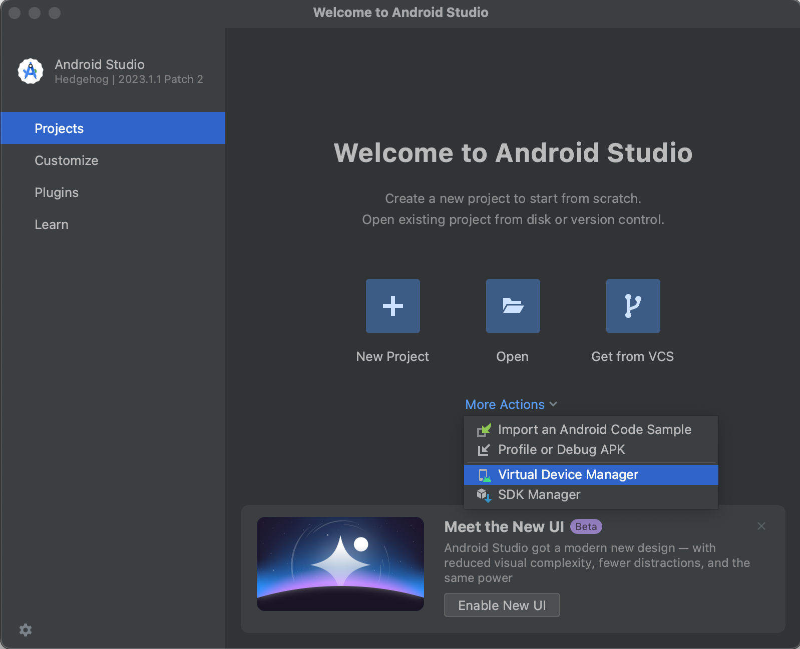
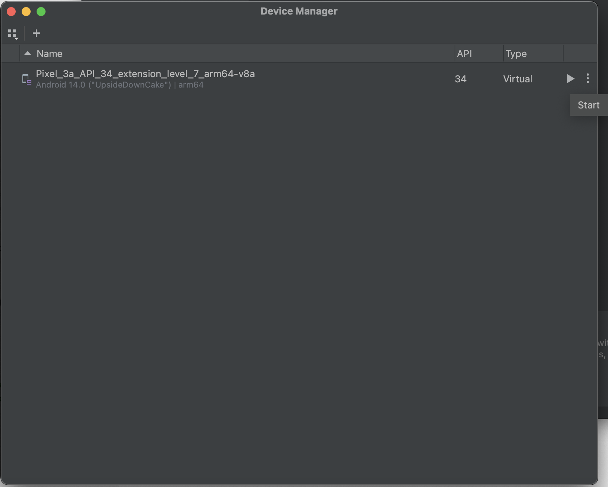
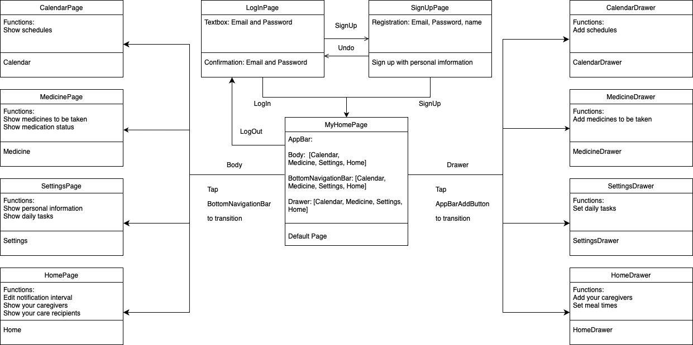

# app

Flutter project. Solution Challenge 2024.

## Demo

### Getting Started With Web
<p>
Please ensure that your current directory is "app" and Google Chrome is installed.
</p>
<p>
Run the following script, then select Chrome.
</p>

```bash
flutter run

#stdout example
Connected devices:
macOS (desktop) • macos  • darwin-arm64   • macOS 13.4 22F66 darwin-arm64
Chrome (web)    • chrome • web-javascript • Google Chrome 121.0.6167.184

No wireless devices were found.
[1]: macOS (macos)
[2]: Chrome (chrome)
Please choose one (or "q" to quit): 2 #Choose 2
```

### Getting Started With Android
<p>
Please ensure that your current directory is "app" and Android Studio is installed.
</p>
<p>
Set up your virtual device in the following way.
</p>



<p>
Run the following script, then our app started with your virtual device.
</p>

```bash
flutter run
```

### Error Handling
If errors occur, please follow the steps below.

#### 1. flutter clean
Let's initialize the `build` and `.dart_tool` directories.
```
flutter clean
```

#### 2. firebase configure
If you encounter any bugs related to Firebase, please execute the following code to initialize Firebase configurations:
```
dart pub global activate flutterfire_cli
```
```
flutterfire configure --project=flutterapp-60eb7
```
`flutterapp-60eb7` is the name of our Firebase project.

## Appendix
### UML
The UML diagram for the page class is stored in "UML" directory.

